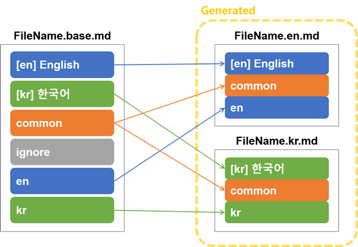

<!---------------------------->
<!-- multilangual suffix: en, kr  -->
<!-- no suffix: en -->
<!---------------------------->

<!-- [en] -->
# Multilingual Markdown Generator
<!-- [kr] -->
# 다국어 마크다운 생성기
<!-- [common] -->


[English](README.md), [한국어](README.kr.md)

<!-- [en] -->
**Table of contents**
<!-- [kr] -->
**목차**
<!-- [common] -->

<!-- [[ multilangual toc: level=2~3 ]] -->

<!-- [en] -->
## How It Works
<!-- [kr] -->
## 작동 방식
<!-- [common] -->


<!-- [en] -->
## Features

- Auto table of contents
- Auto suffix to file name
- No suffix option (for one main language)
- UTF-8 encoding
<!-- [kr] -->
## 기능

- 자동 목차
- 파일 이름 뒤에 자동 접미사
- 접미사 생략 옵션 (한 개 언어만 가능)
- UTF-8 인코딩
<!-- [common] -->

> The output encoding is **'utf-8'**

<!-- [en] -->
## How to Use
<!-- [kr] -->
## 사용법
<!-- [common] -->

<!-- [en] -->
1. Make `{something}.base.md` file
<!-- [kr] -->
1. `{파일이름}.base.md` 파일을 만듭니다.
<!-- [en] -->
2. Run this python file on your project root. Then, this will search all markdowns recursively.
<!-- [kr] -->
2. 프로젝트 루트 위치에서 파이썬 파일을 실행합니다. 그러면 알아서 하위폴더의 마크다운들을 찾아낼 것입니다.
<!-- [common] -->

    ```bash
    python multilang_md.py
    ```

<!-- [en] -->
3. You can find the `{something}.{suffix}.md` files in the same directory. For example:
    - default: `{something}.en.md`, `{something}.kr.md`, `{something}.es.md`, ...
    - no-suffix option to `en`: `{something}.md`, `{something}.kr.md`, `{something}.es.md`, ...
<!-- [kr] -->
3. 각 폴더의 동일한 위치에서 `{파일이름}.{접미사}.md`으로 된 파일들을 볼 수 있습니다. 예를 들어:
    - 기본: `{파일이름}.en.md`, `{파일이름}.kr.md`, `{파일이름}.es.md`, ...
    - `en`에 접미사 생략 옵션: `{파일이름}.md`, `{파일이름}.kr.md`, `{파일이름}.es.md`, ...
<!-- [common] -->

<!-- [en] -->
## Command Tags
<!-- [kr] -->
## 명령어 태그
<!-- [common] -->

<!-- [en] -->
### Headers

Headers must be declared before the body begins.
<!-- [kr] -->
### 헤더

헤더는 반드시 본문이 시작하기 전에 선언되어야 합니다.
<!-- [common] -->

<!-- [en] -->
1. Declare the language you want to use. The following example declares `en` and `kr` as keywords. These keywords are used as suffixes.
<!-- [kr] -->
1. 사용할 언어를 선언하십시오. 다음 예제는 `en`과 `kr`을 키워드로 선언하였습니다. 이 키워드들은 접미사로 사용됩니다. 
<!-- [common] -->

    ```markdown
    <!-- multilangual suffix: en, kr  -->
    ```

<!-- [en] -->
2. The `no suffix` option can prevent the suffix from being appended when creating the file. In other words, setting `no suffix` to `en` will generate `FileName.md` instead of `FileName.en.md`. This is useful because the main `README` in **GitHub** is not recognized when it has a suffix.
<!-- [kr] -->
2. `no suffix` 옵션은 파일을 생성할 때 접미사가 붙는 것을 방지할 수 있습니다. 다시 말하자면 `no suffix`를 `en`으로 설정하면 `파일이름.en.md`가 아니라 `파일이름.md`가 생성됩니다. **GitHub**에서 메인 `README`는 접미사가 붙으면 인식이 안되기 때문에 이 기능이 유용합니다.
<!-- [common] -->

    ```markdown
    <!-- no suffix: en -->
    ```

<!-- [en] -->
### Main Text

Everything that the parser reads after the tag below is recognized as the main text. (So ​​you have to write the header before main).
<!-- [kr] -->
### 본문

파서가 아래의 태그들를 읽는 순간부터 그 이후에 읽는 모든 것은 메인 텍스트로 인식합니다. (그래서 헤더를 메인 이전에 적어야 합니다.)
<!-- [common] -->

<!-- [en] -->
1. **Table of contents**

    목차는 
<!-- [kr] -->
1. **목차**

    아래 태그는 생성기에 의해 자동으로 목차로 교체됩니다. 목차의 수준은 `level` 부분을 통해 정할 수 있습니다. 가장 큰 제목(`# 제목`)은 html에서 `<h1>`이기 때문에 `level 1`입니다.
<!-- [common] -->

    ```markdown
    <!-- [[ multilangual toc: level=2~3 ]] -->
    ```

<!-- [en] -->
1. **Table of contents**

    목차는 
<!-- [kr] -->
    -  `level`을 표기하는 방법은 총 4가지입니다. 여러분의 필요에 따라 숫자는 바꾸시면 됩니다.
        -  `level=2`
        -  `level=2~`
        -  `level=~4`
        -  `level=2~4`
<!-- [common] -->

```markdown
<!-- [en] -->
```
```markdown
<!-- [common] -->
```
```markdown
<!-- [ignore] -->
```
